# Sikumnik Pre-Deployment Audit

## Overview

Full intrusive audit of the Sikumnik course platform before any Vercel deployment. Covers secrets, build, navigation, quiz logic, AI chat, Hebrew RTL, and deployment config.

**YOU MUST complete every phase. Skipping a phase because it "looks fine" is a violation.**

Announce when starting: *"Running Sikumnik pre-deployment audit."*
Use TodoWrite to track each phase as you work.

## Audit Flow

```dot
digraph sikumnik_audit {
    rankdir=TB;

    "Audit triggered" [shape=doublecircle];
    "STOP: .env.local exposed?" [shape=octagon, style=filled, fillcolor=red, fontcolor=white];
    "Phase 0: Secrets" [shape=box];
    "Phase 1: Build" [shape=box];
    "Phase 2: Navigation" [shape=box];
    "Phase 3: Quiz Logic" [shape=box];
    "Phase 4: AI Chat" [shape=box];
    "Phase 5: Hebrew RTL" [shape=box];
    "Phase 6: Vercel Config" [shape=box];
    "Phase 7: Tests" [shape=box];
    "All phases complete?" [shape=diamond];
    "Write final report" [shape=box];
    "Blockers found?" [shape=diamond];
    "NOT READY" [shape=doublecircle];
    "READY FOR DEPLOYMENT" [shape=doublecircle];

    "Audit triggered" -> "Phase 0: Secrets";
    "Phase 0: Secrets" -> "STOP: .env.local exposed?" [label="check git log"];
    "STOP: .env.local exposed?" -> "Phase 1: Build" [label="not committed"];
    "STOP: .env.local exposed?" -> "NOT READY" [label="committed — stop everything"];
    "Phase 1: Build" -> "Phase 2: Navigation";
    "Phase 2: Navigation" -> "Phase 3: Quiz Logic";
    "Phase 3: Quiz Logic" -> "Phase 4: AI Chat";
    "Phase 4: AI Chat" -> "Phase 5: Hebrew RTL";
    "Phase 5: Hebrew RTL" -> "Phase 6: Vercel Config";
    "Phase 6: Vercel Config" -> "Phase 7: Tests";
    "Phase 7: Tests" -> "All phases complete?";
    "All phases complete?" -> "Write final report" [label="yes"];
    "All phases complete?" -> "Write final report" [label="no — mark incomplete"];
    "Write final report" -> "Blockers found?";
    "Blockers found?" -> "NOT READY" [label="yes"];
    "Blockers found?" -> "READY FOR DEPLOYMENT" [label="no"];
}
```



## Phases

Run in order. Each phase has full instructions in `resources/`.

| Phase | File | What It Covers |
|-------|------|----------------|
| 0 | `resources/phase-0-secrets.md` | API keys, .gitignore, .env exposure |
| 1 | `resources/phase-1-build.md` | npm build, TypeScript, ESLint |
| 2 | `resources/phase-2-navigation.md` | Routes, sidebar, next/prev chapter buttons |
| 3 | `resources/phase-3-quiz.md` | Answer-before-reasoning, state, locking |
| 4 | `resources/phase-4-ai-chat.md` | Gemini 2.5 integration, errors, loading |
| 5 | `resources/phase-5-rtl.md` | Hebrew RTL, markdown rendering, Tailwind |
| 6 | `resources/phase-6-vercel.md` | Config, localhost strings, bundle size |
| 7 | `resources/phase-7-tests.md` | Playwright suite, coverage gaps |

## Rationalization Table

These are violations. Do not commit them.

| Excuse | Reality |
|--------|---------|
| "This file looks fine" | Prove it. Run the phase. |
| "Build passed so it works" | Build passing ≠ logic correct. |
| "I already checked navigation" | Did you trace every route to every link? |
| "RTL is probably fine" | `dir="rtl"` missing at root = entire layout broken. |
| "Gemini 2.5 is configured" | Is the key server-side only? Is there error handling? |
| "Tests are passing" | Which tests? Are quiz and navigation covered? |

## Red Flags — STOP

If you catch yourself thinking any of these, stop and run the relevant phase:

- "I'll just quickly deploy and fix it after"
- "That page is accessible from somewhere"
- "The reasoning probably only shows after answering"
- "The API key is fine where it is"

## Final Report Format

EVERY audit ends with this report. No exceptions.

```
==============================================
SIKUMNIK PRE-DEPLOYMENT AUDIT REPORT
Date: [date]
==============================================

VERDICT: READY / NOT READY

🔴 BLOCKERS ([n]) — fix before deploying
  1. [file:line] — problem — fix

🟡 WARNINGS ([n]) — fix soon
  1. [file:line] — problem — fix

🔵 SUGGESTIONS ([n])
  1. [file:line] — note

PHASES: 0✓ 1✓ 2✓ 3✓ 4✓ 5✓ 6✓ 7✓
(mark ✗ for any phase that could not run, explain why)
==============================================
```
