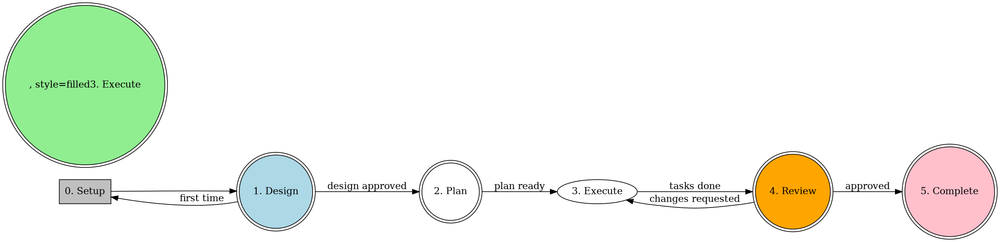

# Sikumnik Development Workflow

This is the **master workflow** that orchestrates all other skills. Follow this flow for every implementation task.

## Quick Reference Card

| Phase | Skill | When | Output |
|-------|-------|------|--------|
| 0. Setup | `using-git-worktrees` | Before starting | Isolated branch |
| 1. Design | `brainstorming` | New feature/change | Approved design |
| 2. Plan | `writing-plans` | After design | Task list |
| 3. Execute | `executing-plans` | With plan | Implemented code |
| 4. Review | `requesting-code-review` | Between/before merge | Approved changes |
| 5. Complete | `finishing-a-development-branch` | All done | Merged/cleaned |

**Command for this project:**
```bash
# Lint & Typecheck
npm run lint && npm run typecheck
```

---

## The Complete Workflow



---

## Phase 0: SETUP (Before Everything)
**Skill:** `using-git-worktrees`

When starting new work:
1. Invoke `using-git-worktrees` skill
2. Create new branch in isolated worktree
3. Verify clean test baseline
4. This isolates work from main codebase

**Output:** Clean isolated workspace on new branch

---

## Phase 1: BRAINSTORMING (Before Code)
**Skill:** `brainstorming`

When user has an idea/feature request:
1. Invoke `brainstorming` skill
2. Explore context, ask questions
3. Propose 2-3 approaches with trade-offs
4. Present design, get user approval
5. Save design doc to `docs/plans/`

**Output:** Approved design document

---

## Phase 2: PLANNING (After Design Approval)
**Skill:** `writing-plans`

After design is approved:
1. Invoke `writing-plans` skill
2. Break work into 2-5 minute tasks
3. Each task has:
   - Exact file paths
   - Complete code to write
   - Verification steps
4. Create TodoWrite for each task
5. Identify independent tasks that can run in parallel

**Output:** Implementation plan with tasks

---

## Phase 3: EXECUTION (With Plan)
**Skills:** `executing-plans` + `test-driven-development`

For each task in order:
1. **Write test FIRST** (if applicable)
   - Invoke `test-driven-development` skill
   - Write failing test
   - Watch it fail
2. **Implement code**
   - Write minimal code to pass test
   - Watch it pass
3. **Verify**
   - Run lint: `npm run lint`
   - Run typecheck: `npm run typecheck`
   - Run tests: `npm test`
4. **Commit** after each task (if applicable)

### Parallel Execution

For independent tasks:
1. Invoke `dispatching-parallel-agents` skill
2. Run multiple tasks simultaneously
3. Merge results

### Hebrew Enforcement (CRITICAL)

For content tasks:
- Verify ALL text is in Hebrew
- Check: `lecturer-SKILL.md` for Hebrew-only rules
- ANY English text is a FAILURE

**Output:** Implemented and verified code

---

## Phase 4: CODE REVIEW
**Skills:** `requesting-code-review` + `receiving-code-review`

Before merging:
1. Invoke `requesting-code-review` skill
2. Present changes for review
3. **If feedback received:**
   - Invoke `receiving-code-review` skill
   - Address feedback
   - Return to Phase 3 (Execute)
4. **If approved:**
   - Continue to Phase 5 (Complete)

**Output:** Approved code changes

---

## Phase 5: COMPLETION (Tasks Done)
**Skill:** `finishing-a-development-branch`

When all tasks complete:
1. Invoke `finishing-a-development-branch` skill
2. Run final verification:
   ```bash
   npm run lint && npm run typecheck && npm test
   ```
3. Present options:
   - **Merge** - Fast-forward to main
   - **PR** - Create pull request
   - **Keep** - Leave branch for later
   - **Discard** - Delete worktree
4. Clean up worktree if requested

**Output:** Completed work integrated

---

## Decision Tree: Which Path?

```
Is this a NEW feature/change?
├─ YES → Use brainstorming
│   └─ Design approved?
│       ├─ YES → writing-plans
│       └─ NO → Revise design
│
├─ NO → Is it a BUG?
│   ├─ YES → Use systematic-debugging
│   └─ NO → Is it CONTENT (lectures/courses)?
│       ├─ YES → Use lecturer skill (Hebrew ONLY)
│       └─ NO → Simple fix → executing-plans
```

---

## When to Use Each Skill

| Situation | Skill to Invoke |
|-----------|-----------------|
| User proposes new feature/change | `brainstorming` |
| Design approved, need tasks | `writing-plans` |
| Ready to implement | `executing-plans` |
| Complex multi-file work | `subagent-driven-development` |
| Independent parallel tasks | `dispatching-parallel-agents` |
| Writing tests | `test-driven-development` |
| Debugging issues | `systematic-debugging` |
| Need isolated workspace | `using-git-worktrees` |
| Code review before merge | `requesting-code-review` |
| Received review feedback | `receiving-code-review` |
| All done, wrap up | `finishing-a-development-branch` |
| Content generation | `lecturer` (Hebrew ONLY) |
| Content extraction | `librarian` |

---

## Critical Rules

1. **NEVER skip brainstorming** - Even "simple" tasks need design review
2. **NEVER implement without a plan** - Use writing-plans first
3. **NEVER skip verification** - Run lint + typecheck + tests
4. **ALWAYS enforce Hebrew** - For content: NO English allowed
5. **ALWAYS use skills proactively** - If 1% chance applies, invoke it
6. **ALWAYS commit after tasks** - Small, atomic commits

---

## Verification Commands

```bash
# Full verification (run this ALWAYS before review)
npm run lint && npm run typecheck && npm test

# Individual checks
npm run lint      # Lint code
npm run typecheck # TypeScript
npm test          # Tests
```

---

## Starting a New Task

When user asks to build/fix/create something:

```
1. "Using dev-workflow to orchestrate..."
2. Invoke using-git-worktrees (first time only)
3. Invoke brainstorming (new feature)
4. Invoke writing-plans (after design)
5. Invoke executing-plans (implementation)
6. Invoke requesting-code-review (before merge)
7. Invoke finishing-a-development-branch (done)
```

This workflow ensures every piece of work is:
- ✅ Isolated in worktree
- ✅ Designed before implemented
- ✅ Planned before executed
- ✅ Tested with TDD
- ✅ Verified (lint + typecheck + tests)
- ✅ Reviewed before merged
- ✅ Hebrew enforced (for content)
- ✅ Completed and cleaned up
